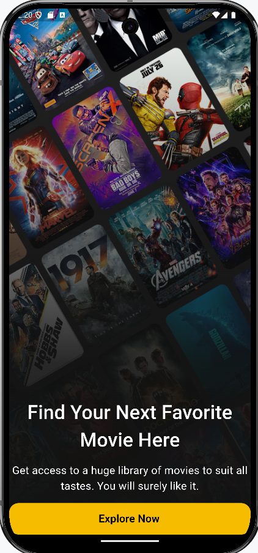
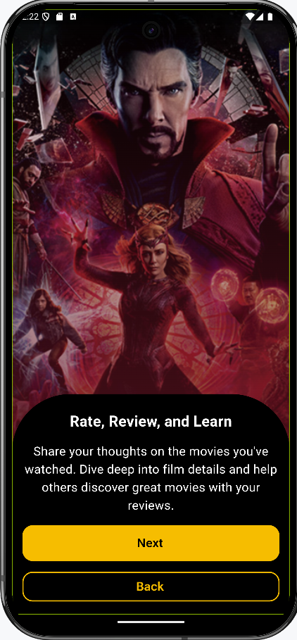
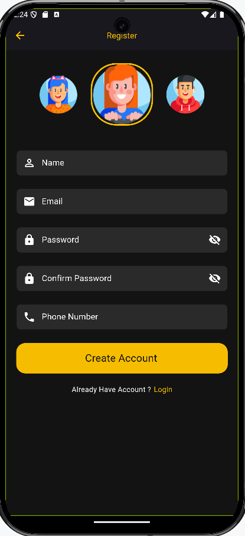
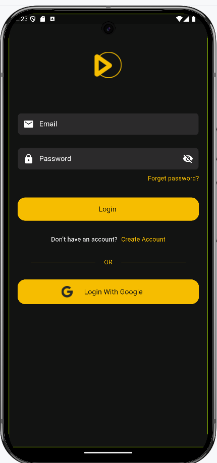
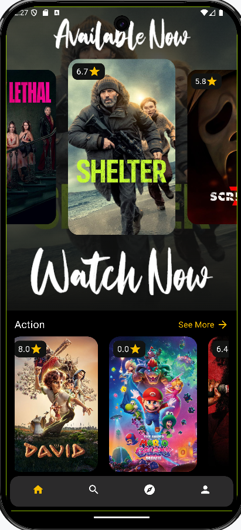
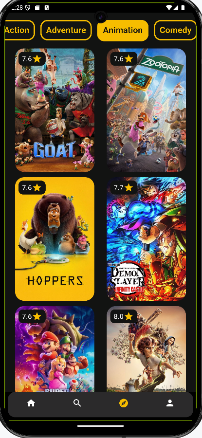
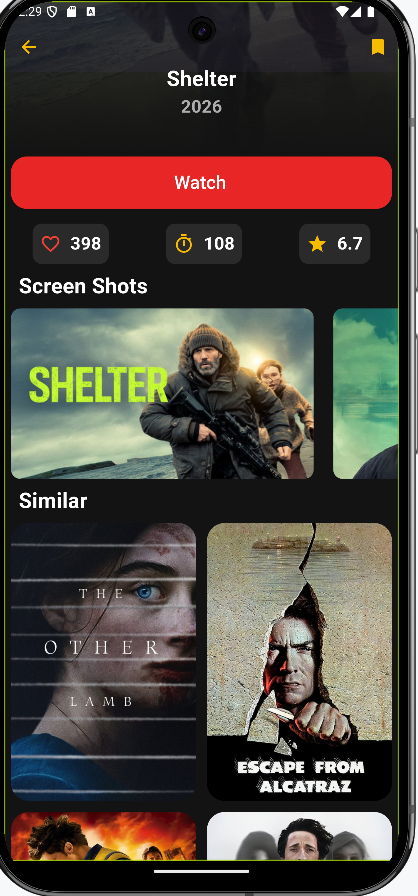
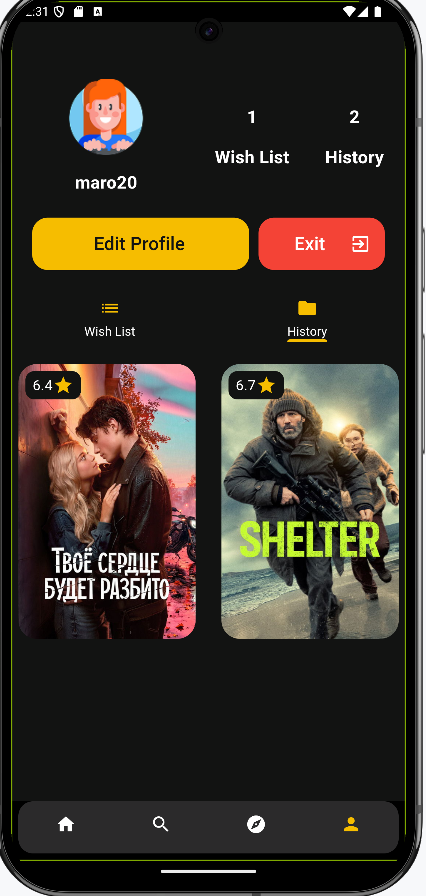

# 🎬 Movies App - Flutter & Firebase

A feature-rich movie discovery application built with **Flutter**, following a robust **Clean Architecture** to ensure scalability and maintainability.

---

## 🚀 Key Features
* **Secure Authentication:** User login and registration using **Firebase Auth** (supports both Email/Password and **Google Sign-In**).
* **Movie Discovery:** Explore the most popular movies and trending titles through external API integration.
* **User Profiles:** Fully functional profile management, allowing users to update their info and select custom avatars, synced in real-time with **Cloud Firestore**.
* **Watch History:** A dedicated log for users to keep track of movies they have viewed.
* **Wishlist:** Ability to add/remove movies from a personal favorites list.
* **Responsive UI:** Modern, dark-themed design optimized for all screen sizes using `flutter_screenutil`.

---

## 🛠 Tech Stack & Architecture
This project implements **Clean Architecture** (Data, Domain, and Presentation layers) to decouple business logic from the UI.

* **State Management:** [Bloc](https://pub.dev/packages/flutter_bloc) (Predictable state management).
* **Dependency Injection:** [GetIt](https://pub.dev/packages/get_it) & [Injectable].
* **Navigation:** [AutoRoute](https://pub.dev/packages/auto_route) (Strongly-typed routing).
* **Backend:** [Firebase](https://firebase.google.com/) (Authentication & Cloud Firestore).
* **Networking:** [Dio](https://pub.dev/packages/dio) for efficient API requests.
* **Local Assets:** Custom icons and high-quality movie posters.

---

## 📸 Screenshots

  
  
  
  
  
  
  
  

---
